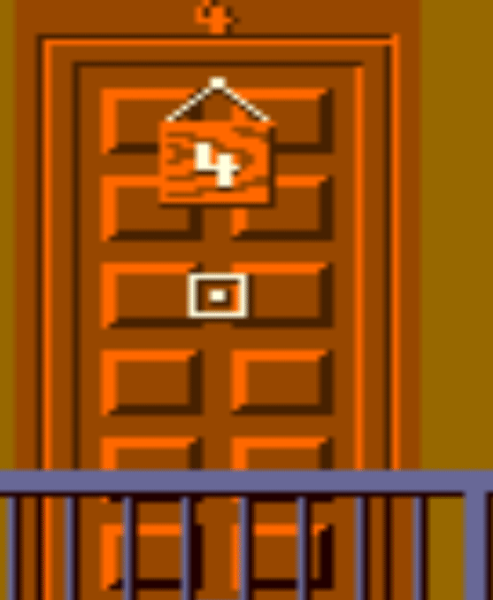

# Introducción a Python

## Semana 16
<!-- .element style="text-align:center" -->

 <!-- .element style="margin-left: auto; margin-right: auto; display: block" -->

---

<section data-background-iframe="https://www.youtube.com/embed/Ln0T5bjDuWw?si=u7CGP0xyLahAQloF&amp;start=16">
</section>

---

# Cómo trabajar

En local:
- Sigue las instrucciones de `ejemplos/README.md`

Online:
- https://trinket.io/features/pygame
- https://replit.com/languages/pygame

---

# Repaso

```python
...

# Prepara la pantalla
WIDTH, HEIGHT = 800, 600
screen = pygame.display.set_mode((WIDTH, HEIGHT))

square_size = 10
x, y = 100,100

while running:
    # Gestiona eventos
    for event in pygame.event.get():
        if event.type == pygame.QUIT:
            running = False


    clock.tick(30) # Ajusta FPS

    # Pinta algo
    pygame.draw.rect(
      screen, (255,0,0),
      (x, y, square_size, square_size)
    )

    # Actualiza el display
    pygame.display.flip()
```
<!-- .element style="font-size: 1.5rem;" -->

---

# Imágenes

Uso básico de imágenes:
```python
mario = pygame.image.load('sprites/mario/mario_quieto.png')
screen.blit(mario, (mario_x, mario_y))
```
<!-- .element style="font-size: 1.5rem;" -->

Las imágenes se pueden escalar:
```python
imagen_escalada = pygame.transform.scale(imagen, (nuevo_ancho, nuevo_alto))
```
<!-- .element style="font-size: 1.5rem;" -->

---

# Movimiento

Se pueden usar varias imágenes para simular movimiento

```python
last_frame_update = pygame.time.get_ticks()
....
current_time = pygame.time.get_ticks()
```
- `pygame.time.get_ticks()` devuelve el tiempo en milisegundos desde que se inició el juego
- Se puede asignar un determinado tiempo a cada frame
- Para recorrer un array de forma circular se puede usar el operador módulo `%`

También sirve para ajustar la velocidad: `v = d / t`

---

# Ejercicio 1

 <!-- .element style="margin-left: auto; margin-right: auto; display: block" -->

- Esperar a que se pulse una tecla
- Mostrar el disparo
- Ir cambiando la imagen del disparo

Si has acabado, puedes probar a hacer tres disparos en tres puertas

---

# Capas

- Normalmente necesitaremos "apilar" objetos en el juego
- Cuando hay muchos objetos esto puede complicarse. Para ello, se pintan objetos en capas:

```python
background_layer = pygame.Surface(screen.get_size())
 # Use SRCALPHA for transparency
sprite_layer = pygame.Surface(screen.get_size(), pygame.SRCALPHA)
front_layer = pygame.Surface(screen.get_size(), pygame.SRCALPHA)
```
<!-- .element style="font-size: 1.5rem;" -->

- Se pinta cada objeto en su capa. Habrán capas que quizá no cambien en todo el juego, como el fondo:
```python
sprite_layer.blit(imagen, (sprite_x, sprite_y))
```
<!-- .element style="font-size: 1.5rem;" -->
- Después se pintan en orden:
```python
screen.blit(background_layer, (0, 0))
screen.blit(sprite_layer, (0, 0))
screen.blit(front_layer, (0, 0))
```
<!-- .element style="font-size: 1.5rem;" -->


